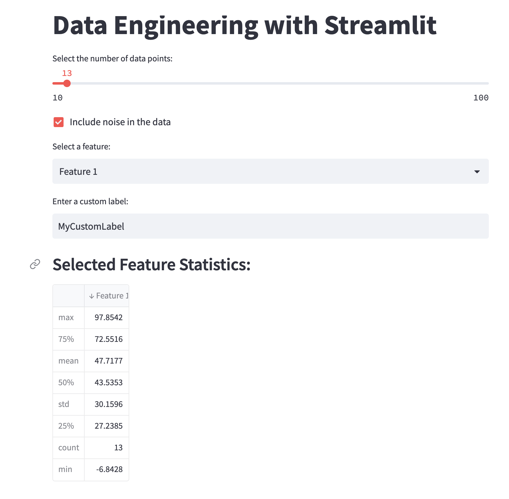
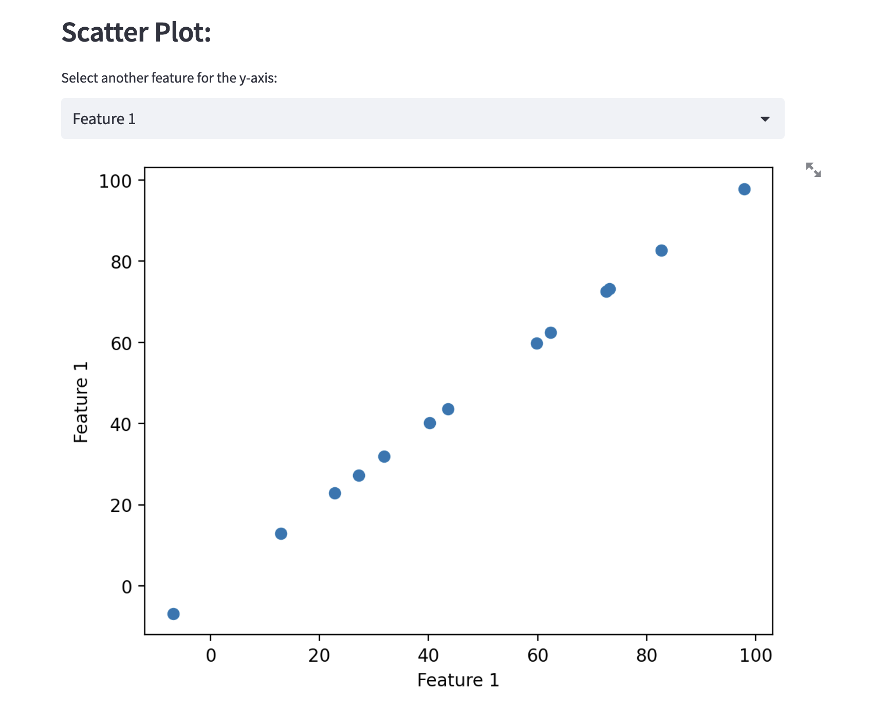
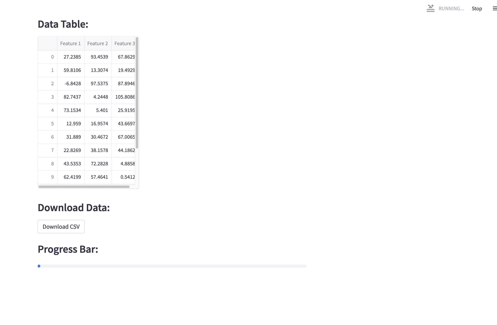
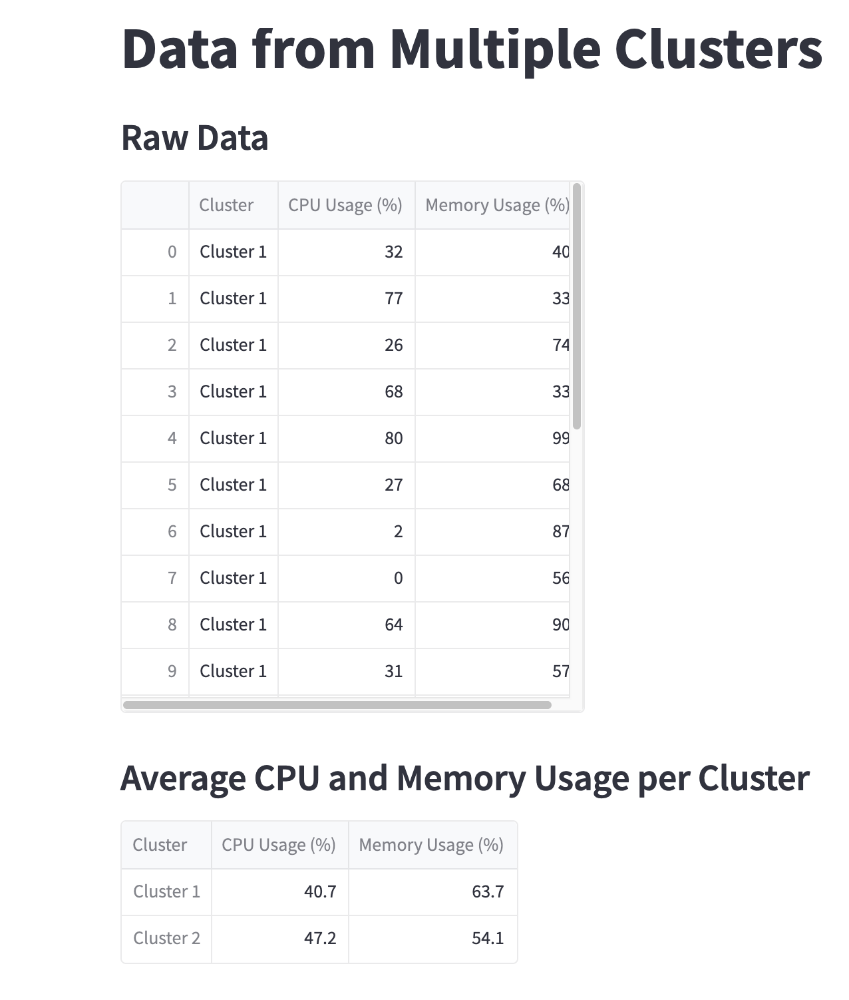
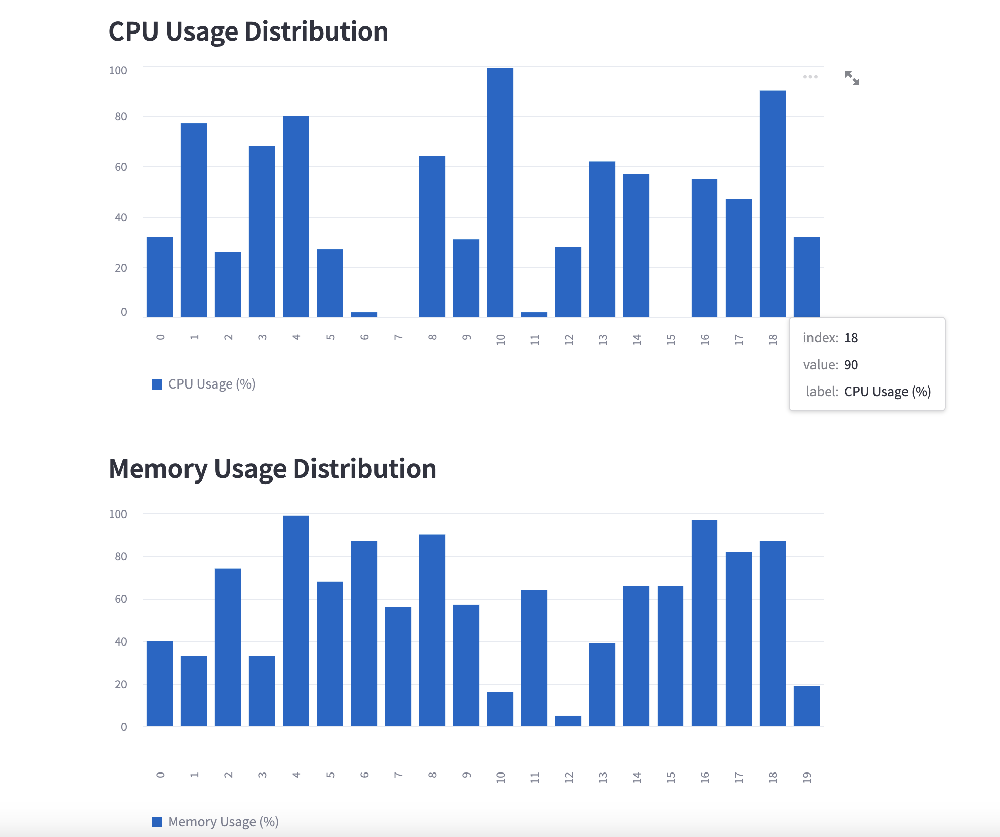

# Using Streamlit application
## Working Examples
Two examples are shown to demonstrate usage of Streamlit.
**</br>Example 1 :**
 - This example demonstrates a data engineering dashboard using various Streamlit widgets. 

 - It includes a sidebar for data filtering, data loading and processing based on selected filters, data summary, bar chart visualization, scatter plot visualization, data export in CSV or Excel format, and data download functionality.

  - Data engineers can explore different datasets, filter data based on date range, visualize data using different charts, export processed data, and download the data for further analysis.



**</br>Example 2 :**
 - This is a very straightforward example just to illustrate the usage of this library for non-data related tasks.
  - For example, obtaining output from CLI based tasks and displaying the results in browser or many more use cases.



## Steps to Run
 - Ensure all the required libraries present in `requirements.txt` are installed.

 ```shell
    pip install -r requirements.txt
 ```
 - Open terminal and navigate to the path where required file/example is present and execute the command.
 
 - Command to run streamlit applications [both are equivalent commands]:  
`python -m streamlit run your_script.py` </br>or </br>
`streamlit run file_name.py`
 

## Output
### Terminal
```shell
$ streamlit run example2.py 

You can now view your Streamlit app in your browser.

Local URL: http://localhost:8501
Network URL: http://192.168.1.146:8501
```
